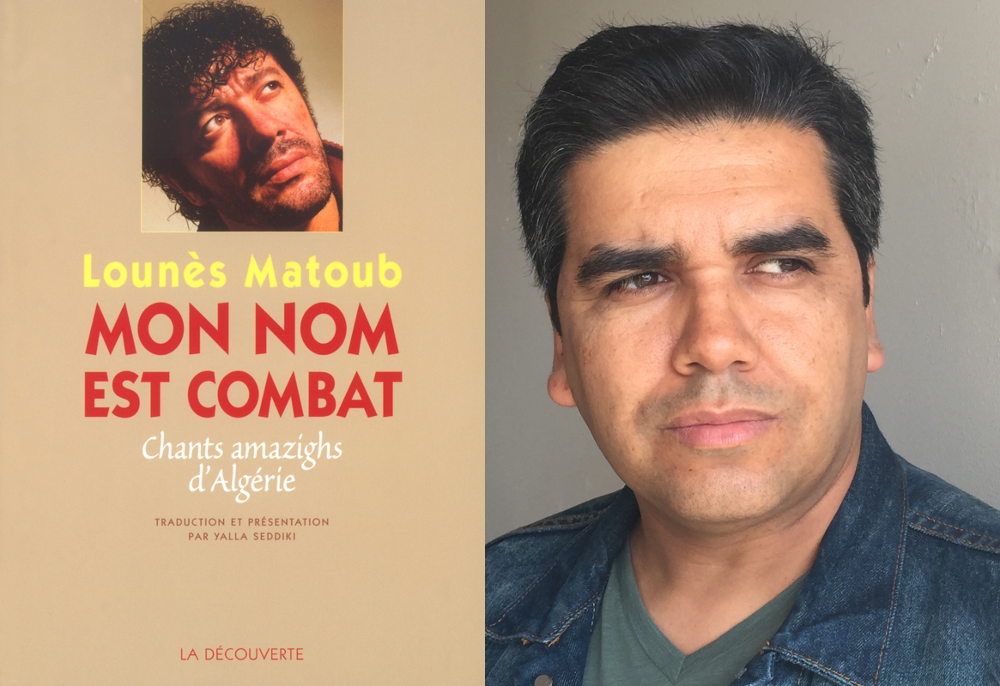

## Liberté d'expression, liberté artistique et éducation populaire à travers la figure emblématique de Matoub Lounès

**Samedi 17 mai 2025**, conférence exceptionnelle de **Yalla Seddiki**, à l'occasion de la sortie de son ouvrage *L'appel des montagnes* (avril 2025), avec des enregistrements inédits du chanteur.

## Qui est Matoub Lounès?

> "Je préfère mourir pour mes idées que de mourir de vieillesse."

Matoub Lounès, né le 24 janvier 1956 en Kabylie (Algérie), était l'une des très grandes figures de la chanson kabyle, admiré par des millions de personnes en Afrique du Nord, en Europe et au Canada. Kidnappé le 25 septembre 1994 par le Groupe armé islamiste (GIA), il fut libéré le 20 octobre 1994 après d'immenses mobilisations artistiques et citoyennes en France et en Algérie.

En France, où il a effectué de nombreux séjours et s'est produit régulièrement, son engagement a été salué par la communauté artistique bien au-delà de la communauté kabyle (estimée à environ 100 000 personnes en Auvergne Rhône-Alpes).

Dans le contexte international actuel, marqué par la montée de l'autoritarisme, la répression des voix dissidentes et les menaces contre les journalistes et artistes engagés, Matoub Lounès incarne plus que jamais la résistance par la parole et l'art. Son assassinat demeure un symbole de la lutte pour la liberté d'expression, un combat toujours d'actualité face aux pressions exercées sur les intellectuels, militants et créateurs à travers le monde.

## Le conférencier

{ width=50% }

**Yalla Seddiki** est docteur en Lettres Modernes (Université Paris IV-Sorbonne) et auteur notamment de :
* *Mon nom est combat – Poèmes algériens chantés en tamazight de Kabylie*
* *Rimbaud is Rimbaud – Rien de nouveau chez Rimbaud*
* *Guy Debord Automythographe – Un parcours critique*

## Contenu et objectifs de la conférence

La liberté d'expression et la liberté artistique sont des piliers fondamentaux des sociétés démocratiques. Elles jouent un rôle essentiel dans la formation de l'esprit critique et dans l'émancipation des individus. La figure de Matoub Lounès, chanteur engagé et militant pour les droits culturels et linguistiques, constitue un prisme particulièrement pertinent pour explorer ces enjeux. Yalla Seddiki qui a connu et travaillé avec l'artiste est un intellectuel et spécialiste reconnu sur ces questions, proposera une réflexion approfondie et interdisciplinaire essentielle pour la communauté universitaire et associative.

### La conférence abordera notamment les aspects suivants :

#### Analyse sociopolitique de la liberté d'expression et de la liberté artistique
- Définition et enjeux contemporains de ces libertés dans différentes sociétés.

#### Matoub Lounès : figure emblématique de la résistance culturelle
- Son engagement pour les libertés fondamentales, la laïcité et les droits culturels et linguistiques.
- Sa musique comme outil de mobilisation politique et sociale.

#### L'éducation populaire : levier d'émancipation
- Liens entre culture, éducation et citoyenneté.
- Transmission des valeurs démocratiques par l'art et la musique.

### Impact attendu de la conférence :
- Illustrer la diversité des « Musiques du Monde ».
- Contribuer au dialogue entre sciences sociales, philosophie politique et études culturelles.
- Réfléchir au rôle de l'art dans la défense des libertés fondamentales.
- Mettre en avant l'universalité du combat de l'artiste.
- Consolider les liens entre savoirs populaires et académiques.

## Public ciblé

Le public visé regroupera les associations partenaires d'Assa Azekka (AA) ainsi que les étudiants en musicologie, sociologie, sciences politiques et disciplines connexes, compte tenu du caractère universel (liberté d'expression) et transversal (culture, musique, enjeux sociologiques, culturels, politiques et artistiques) du thème.

## Déroulé prévisionnel (14h00 - 17h00)

- **14h00** : Accueil et ouverture par l'Université et AA (10 min)
- **14h10 à 15h40** : Conférence de Yalla Seddiki suivie d'échanges avec le public (1h30)
- **15h40 à 16h00** : Pause
- **16h00 à 17h00** : Moment musical avec des artistes engagés sur cette thématique

## Organisation et répartition des frais

### Assa Azekka prendra en charge :
- Communication grand public (affiches, diffusion)
- Frais de déplacement et hébergement de l'intervenant
- Frais de restauration
- Défraiement des musiciens

**Soit un prévisionnel total : 1200 €**

### Partenariat avec l'Université :
- Partenariat pédagogique (liens avec les enseignements, enjeux éducatifs)
- Mise à disposition (ou partage des frais) de la salle et du technicien audiovisuel

Par cette collaboration, AA souhaite s'appuyer sur l'expertise et l'engagement de l'Université dans la transmission des savoirs, le développement de l'esprit critique et la défense des libertés d'expression, particulièrement pertinents dans le contexte sociopolitique actuel.

